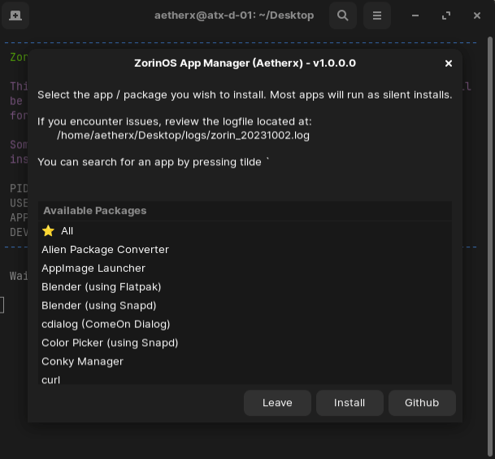
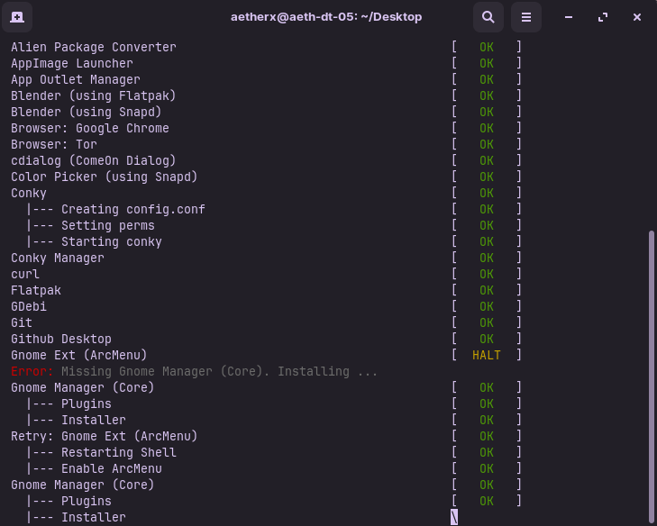
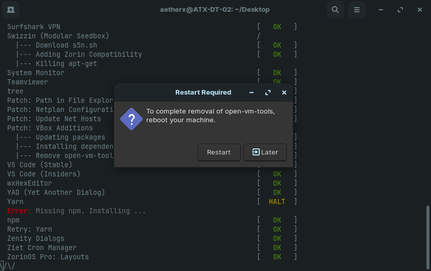

<p align="center"></p>
<h1 align="center"><b>Zorin App Manager</b></h1>

<div align="center">

     [](https://github.com/Aetherinox/zorin-app-manager/releases/)

</div>

<br />
<br />

> [!WARNING]
> This script has been developed for ZorinOS [based on 20.04.6 LTS (Focal Fossa)] and Ubuntu platforms. At present, other distributions are not planned until stability has been reached on its originally planned distros.

<br />

---

<br />

- [About](#about)
- [Packages](#packages)
- [Patches](#patches)
- [Usage](#usage)
  - [Configuration](#configuration)
  - [Install](#install)
  - [Prerequisites](#prerequisites)
  - [Logs](#logs)
- [Command-line Arguments](#command-line-arguments)
- [Wiki](#wiki)
- [Footnotes](#footnotes)

<br />

---

<br />

## About
This is an application manager targeted toward `ZorinOS` and distros using `Ubuntu 22.04 LTS`. The Zorin App Manager allows users to install a number of apps, packages, and libraries right from the menu with little interaction. 

This manager features a selection menu which allows you to choose which programs you wish to install onto your device. Any programs that have dependencies will be taken care of automatically with no input from you unless the program requires you to configure it.

<br />

<p align="center"></p>

<br />

<p align="center"></p>

<br />

<p align="center"></p>

<br />

---

<br />

## Packages
| App                                                                                         | Descript |
| ------------------------------------------------------------------------------------------- | -------- |
| [Alien Package Converter](http://joeyh.name/code/alien/)                              | Converts between the rpm, dpkg, stampede slp, and slackware tgz file formats |
| [AppImage Launcher](https://github.com/TheAssassin/AppImageLauncher)                  | Manage `.appimage` files in one place         |
| [Blender (Flatpak)](https://flathub.org/apps/org.blender.Blender)                     | Free / Open-source 3D creation suite          |
| [Blender (Snap)](https://snapcraft.io/blender)                                        | Free / Open-source 3D creation suite          |
| [cdialog (Comeon Dialog)](https://launchpad.net/~eugenesan/+archive/ubuntu/ppa)       | Create bash shell dialogs                     |
| [Color Picker (Snapd)](https://snapcraft.io/color-picker)                             | Advanced color-picker                         |
| [Conky](https://github.com/brndnmtthws/conky)                                         | System monitor software                       |
| [Conky Manager](https://github.com/zcot/conky-manager2)                               | GUI for managing Conky widgets / themes       |
| [curl](https://packages.ubuntu.com/search?keywords=curl)                              | Command line tool for transferring data with URL syntax |
| [Flatpak](https://flatpak.org/)                                                       | Utility for software deployment and package management |
| [GDebi .deb Package Manager](https://pkgs.org/download/gdebi)                         | Program for installing debian executable files |
| [Git](https://git-scm.com/download/linux)                                             | Version control system (Command-line)         |
| [Github Desktop](https://github.com/Aetherinox/zorin-apt-repo/tree/master/incoming)   | Github Desktop for linux.                     |
| [Gnome Extension Manager (Core)](https://flathub.org/apps/com.mattjakeman.ExtensionManager) [^2] | Utility for browsing / installing GNOME Shell Extensions.         |
| [Gnome Extension: ArcMenu](https://extensions.gnome.org/extension/3628/arcmenu/) [^1]      | Replacement shell for Linux. Includes MacOS / Windows themes.  |
| [Gnome Extension: Internet Speed Monitor](https://launchpad.net/indicator-multiload) [^1]  | Monitor network traffic as widget |
| [gPick (Color Picker)](https://github.com/thezbyg/gpick)                              | Color picker |
| [Kooha](https://github.com/SeaDve/Kooha)                                              | Screen recorder |
| [lintian](https://wiki.debian.org/Teams/Lintian)                                      | Package checker for creating Debian packages  |
| [members](https://packages.ubuntu.com/search?keywords=members)                        | Tool for displaying the users of a group |
| [mlocate](https://github.com/msekletar/mlocate)                                       | Find files on your computer  |
| [neofetch](https://github.com/dylanaraps/neofetch)                                    | Command-line system information tool  |
| [net-tools](https://packages.ubuntu.com/search?keywords=net-tools)                    | Network management toolkit |
| [NPM](https://npmjs.com/)                                                             | Package installer |
| [ocs-url](https://opendesktop.org/p/1136805/)                                         | Helper program for items served via ocs:// |
| [Pacman Package Management](https://gitlab.com/trivoxel/utilities/deb-pacman)         | Emulates the Archlinux Pacman package manager for Debian users who may prefer Pacman over Apt. |
| [Pihole](https://github.com/pi-hole/pi-hole/#one-step-automated-install)              | Ads and tracker blocking app which acts as a DNS sinkhole |
| [reprepro (Apt on Github)](https://github.com/ionos-cloud/reprepro)                   | Debian package repository producer  |
| [RPM Package Manager](https://packages.ubuntu.com/focal/rpm)                          | RPM Package Manager |
| [Seahorse + seahorse-nautilus](https://github.com/GNOME/seahorse)                     | Manage encryption keys and passwords in GNOME Keyring |
| [Snapd](https://github.com/snapcore/snapd)                                            | Install and manage packages  |
| [Surfshark](https://surfshark.com/download/linux)                                     | VPN application |
| [Swizzin](https://github.com/swizzin/swizzin)                                         | Modular seedbox solution (torrents) 15+ apps bundled  |
| [System Monitor / Multiload Indicator](https://launchpad.net/indicator-multiload)     | Monitor CPU, Memory, Network stats in widget  |
| [Teamviewer](https://www.teamviewer.com/en-us/download/linux/)                        | Remote desktop application |
| [Tree](https://packages.ubuntu.com/search?keywords=tree)                              | View files in tree-like ASCII structure  |
| [Unrar](https://packages.ubuntu.com/search?keywords=unrar)                            | Manage rar files / extraction |
| [Visual Studio Code (Stable)](https://code.visualstudio.com/)                         | IDE for developers / source-code editor (Stable) |
| [Visual Studio Code (Insiders)](https://code.visualstudio.com/insiders/)              | IDE for developers / source-code editor (Testing) |
| [wxHexEditor)](https://github.com/EUA/wxHexEditor)                                    | Hex editor |
| [YAD (Yet Another Dialog)](https://github.com/v1cont/yad)                             | Create bash shell dialogs. Based on Zenity. |
| [Yarn](https://github.com/yarnpkg/berry)                                              | Modern package manager |
| [Zenity Dialogs](https://gitlab.gnome.org/GNOME/zenity)                               | Create bash shell dialogs |
| [Ziet Cron Manager](https://github.com/loimu/zeit)                                    | Manage crons in browser admin panel  |

<br />

## Patches
- File Manager displays full path in address bar
- Netplan Configuration
  - Default network adapter renamed to `eth0`
  - Automatically assigns static ip address
  - Configures network adapter to use Quad9 DNS servers
- Update Network /etc/hosts file
- VBox Additions package disrepency issue with non-Pro releases.

<br />

---

<br />

## Usage
Information related to using this wizard.

<br />

### Configuration
This script contains many features that may have settings that you might not want. It is HIGHLY recommended that you open the `setup.sh` file in a text editor and review the settings. One particular feature is the `Netplan Configuration` which has default settings that include what static ip address to assign to the network adapter, as well as the default gateway, and Quad9 DNS servers.

<br />

### Install
To use this script, do the following:

<br />

> [!WARNING]
> Do not run `sudo` when executing this script. The script will automatically ask you for sudo permission. It needs to be ran as the user you are currently logged in as.

<br />

```shell
wget "https://raw.githubusercontent.com/Aetherinox/zorin-app-manager/main/setup.sh"
```

Once you download the script to a location on your machine, set its permissions to be `executable`
```shell
sudo chmod +x setup.sh
```

Finally, run the script
```shell
./setup.sh
```

<br />
<br />

### Prerequisites
If you make a selection that requires a prerequisite package, that package will be automatically installed first, and then your selected item.

<br />
<br />

### Logs
When this installer is launched, a `/logs/zorin_[DATE].log` file will be generated in the same location as the setup script. Most apps will be installed silently / unattended. If you wish to check the status of a task, view the `zorin_[DATE].log` file. 

> [!NOTE]
> If you create an Issue / Bug report on Github, you will be asked to copy/paste your logs. Ensure you do this so that your issue can be reviewed in full and not delayed.

<br />

---

<br />

## Command-line Arguments
The following options can be appended to the end of the `./setup.sh` command

| Option | Name | Desc |
| --- | --- | --- |
| `-d` | Dev Mode | <br /> Specialized list of apps will appear instead of the installable list.<br />Also displays debugging prints. <br /> <br /> |
| `-h` | Help | <br /> Display command help <br /> <br /> |
| `-n` | Dev: Null Run | <br /> Any of the installable applications selected will do a "fake" / null install. No actual install will take place. <br /> <br /> Only works without `-d` <br /> <br />  |
| `-s` | Silent | <br /> All logging will be disabled <br /> <br /> |
| `-t [THEME]` | Theme | <br /> Switches the theme that the interface uses. <br /><br />`Adwaita`, `Adwaita-dark`, `HighContrast`, `HighContrastInverse`, `ZorinBlue-Light` [^3], `ZorinBlue-Dark` [^3] <br /> <br /> |
| `-v` | Version | <br /> Version information <br /> <br />  |

<br />

---

<br />

## Wiki
For detailed documentation, please visit this repo's [Wiki](https://github.com/Aetherinox/zorin-app-manager/wiki)

<br />

---

<br />
<br />
<br />
<br />

## Footnotes
[^1]: This program requires Gnome Extension Manager to be installed first.
[^2]: If installing any of the Gnome extensions, this core must be installed first. Please note that when installing this app, it may take upwards of 5-10 minutes depending on your machine. The rotating cursor means that it is installing.
[^3]: Only available if using `ZorinOS`
