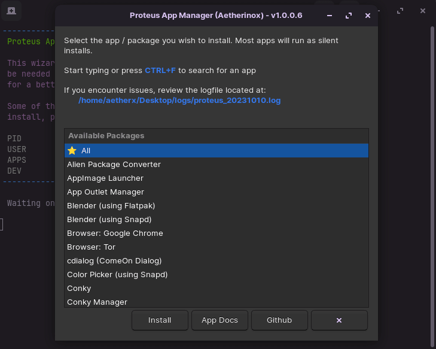

<p align="center"></p>
<h1 align="center"><b>ZorinOS App Manager</b></h1>

<br />
<br />

> [!WARNING]
> This script has been specifically developed for ZorinOS v16.x [based on 20.04.6 LTS (Focal Fossa)]. There is absolutely no guarantee that this will work on other distros. There's a good likelihood that most features will work, but use at your own risk.

<br />
<br />

## About
This is a simple application manager which allows you to install a number of programs right from the menu with little interaction. The packages and libraries provided are from personal choice, since these are the things I like to have when I get a new server going. The latest version includes a GUI which allows you to select the programs you wish to install.

<p align="center"></p>

<br />

---

<br />

## Packages Included
| App                                                                                         | Descript |
| ------------------------------------------------------------------------------------------- | -------- |
| [Alien Package Converter](http://joeyh.name/code/alien/)                              | converts between the rpm, dpkg, stampede slp, and slackware tgz file formats |
| [AppImage Launcher](https://github.com/TheAssassin/AppImageLauncher)                  | Manage `.appimage` files in one place         |
| [Blender (Flatpak)](https://flathub.org/apps/org.blender.Blender)                     | Free / Open-source 3D creation suite          |
| [Blender (Snap)](https://snapcraft.io/blender)                                        | Free / Open-source 3D creation suite          |
| [cdialog (Comeon Dialog)](https://launchpad.net/~eugenesan/+archive/ubuntu/ppa)       | Create bash shell dialogs                     |
| [Color Picker (Snapd)](https://snapcraft.io/color-picker)                             | Advanced color-picker                         |
| [Conky v1](https://pkgs.org/download/conky-all)                                       | GUI for managing Conky widgets                |
| [Conky v2](https://github.com/teejee2008/conky-manager)                               | GUI for managing Conky widgets                |
| [curl](https://packages.ubuntu.com/search?keywords=curl)                              | Command line tool for transferring data with URL syntax |
| [Flatpak](https://flatpak.org/)                                                       | Utility for software deployment and package management |
| [GDebi .deb Package Manager](https://pkgs.org/download/gdebi)                         | Program for installing debian executable files |
| [Git](https://git-scm.com/download/linux)                                             | Version control system (Command-line)         |
| [Github Desktop](https://github.com/Aetherinox/zorin-apt-repo/tree/master/incoming)   | Github Desktop for linux.                     |
| [Gnome Extension Manager (Core)](https://flathub.org/apps/com.mattjakeman.ExtensionManager) | Utility for browsing / installing GNOME Shell Extensions.         |
| [Gnome Extension: ArcMenu](https://extensions.gnome.org/extension/3628/arcmenu/)      | Replacement shell for Linux. Includes MacOS / Windows themes.  |
| [Gnome Extension: Internet Speed Monitor](https://launchpad.net/indicator-multiload)  | Monitor network traffic as widget |
| [gPick (Color Picker)](https://github.com/thezbyg/gpick)                              | Color picker |
| [Kooha](https://github.com/SeaDve/Kooha)                                              | Screen recorder |
| [members](https://packages.ubuntu.com/search?keywords=members)                        | Tool for displaying the users of a group |
| [mlocate](https://github.com/msekletar/mlocate)                                       | Find files on your computer  |
| [neofetch](https://github.com/dylanaraps/neofetch)                                    | Command-line system information tool  |
| [net-tools](https://packages.ubuntu.com/search?keywords=net-tools)                    | Network management toolkit |
| [NPM](https://npmjs.com/)                                                             | Package installer |
| [ocs-url](https://opendesktop.org/p/1136805/)                                         | Helper program for items served via ocs:// |
| [Pacman Package Management](https://gitlab.com/trivoxel/utilities/deb-pacman)         | Emulates the Archlinux Pacman package manager for Debian users who may prefer Pacman over Apt. |
| [Pihole](https://github.com/pi-hole/pi-hole/#one-step-automated-install)              | Ads and tracker blocking app which acts as a DNS sinkhole |
| [reprepro (Apt on Github)](https://github.com/ionos-cloud/reprepro)                   | Debian package repository producer  |
| [RPM Package Manager](https://packages.ubuntu.com/focal/rpm)                          | RPM Package Manager |
| [Seahorse + seahorse-nautilus](https://github.com/GNOME/seahorse)                     | Manage encryption keys and passwords in GNOME Keyring |
| [Snapd](https://github.com/snapcore/snapd)                                            | Install and manage packages  |
| [Surfshark](https://surfshark.com/download/linux)                                     | VPN application |
| [Swizzin](https://github.com/swizzin/swizzin)                                         | Modular seedbox solution (torrents) 15+ apps bundled  |
| [System Monitor / Multiload Indicator](https://launchpad.net/indicator-multiload)     | Monitor CPU, Memory, Network stats in widget  |
| [Teamviewer](https://www.teamviewer.com/en-us/download/linux/)                        | Remote desktop application |
| [Tree](https://packages.ubuntu.com/search?keywords=tree)                              | View files in tree-like ASCII structure  |
| [Unrar](https://packages.ubuntu.com/search?keywords=unrar)                            | Manage rar files / extraction |
| [Visual Studio Code (Stable))](https://code.visualstudio.com/)                        | IDE for developers / source-code editor (Stable) |
| [Visual Studio Code (Insiders))](https://code.visualstudio.com/insiders/)             | IDE for developers / source-code editor (Testing) |
| [wxHexEditor)](https://github.com/EUA/wxHexEditor)                                    | Hex editor |
| [YAD (Yet Another Dialog)](https://github.com/v1cont/yad)                             | Create bash shell dialogs. Based on Zenity. |
| [Yarn](https://github.com/yarnpkg/berry)                                              | Modern package manager |
| [Zenity Dialogs](https://gitlab.gnome.org/GNOME/zenity)                               | Create bash shell dialogs |
| [Ziet Cron Manager](https://github.com/loimu/zeit)                                    | Manage crons in browser admin panel  |
| [ZorinOS Pro: Layouts](#zorinos-pro-layouts)                                          | Professional layouts included in ZorinOS Pro |

<br />

## Tweaks / Changes
- File Manager displays full path in address bar
- Netplan Configuration
  - Default network adapter renamed to `eth0`
  - Automatically assigns static ip address
  - Configures network adapter to use Quad9 DNS servers
- Update Network /etc/hosts file
- VBox Additions package disrepency issue with non-Pro releases.
- ZorinOS Pro Layouts

<br />

---

<br />

## Usage
Information related to using this wizard.

<br />

### Configuration
This script contains many features that may have settings that you might not want. It is HIGHLY recommended that you open the `setup.sh` file in a text editor and review the settings. One particular feature is the `Netplan Configuration` which has default settings that include what static ip address to assign to the network adapter, as well as the default gateway, and Quad9 DNS servers.

<br />

### Install
To use this script, do the following:

<br />

> [!WARNING]
> Do not run `sudo` when executing this script. The script will automatically ask you for sudo permission. It needs to be ran as the user you are currently logged in as.

<br />

```shell
wget "https://raw.githubusercontent.com/Aetherinox/zorin-app-manager/main/setup.sh"
```

Once you download the script to a location on your machine, set its permissions to be `executable`
```shell
sudo chmod +x setup.sh
```

Finally, run the script
```shell
./setup.sh
```

<br />
<br />

### Prerequisites
If you make a selection that requires a prerequisite package, that package will be automatically installed first, and then your selected item.

<br />
<br />

### Logs
When this installer is launched, a `/logs/zorin_[DATE].log` file will be generated in the same location as the setup script. Most apps will be installed silently / unattended. If you wish to check the status of a task, view the `zorin_[DATE].log` file. 

> [!NOTE]
> If you create an Issue / Bug report on Github, you will be asked to copy/paste your logs. Ensure you do this so that your issue can be reviewed in full and not delayed.

<br />

---

<br />

## ZorinOS Pro Features
Even though this release includes ZorinOS Pro layouts, there are still reasons to purchase ZorinOS Pro which include:
- Zorin Installation Support
- Support developers of ZorinOS

<br />

---

<br />

## Packages
Some of the packages in this wizard include what ZorinOS Pro comes with. If you are a ZorinOS Lite or Core user, some of the packages here will give you the features that a ZorinOS Pro user would have including:
- [About](#about)
- [Packages Included](#packages-included)
- [Tweaks / Changes](#tweaks--changes)
- [Usage](#usage)
  - [Configuration](#configuration)
  - [Install](#install)
  - [Prerequisites](#prerequisites)
  - [Logs](#logs)
- [ZorinOS Pro Features](#zorinos-pro-features)
- [Packages](#packages)
  - [ArcMenu](#arcmenu)
  - [Conky Manager](#conky-manager)
  - [Internet Speed Monitor](#internet-speed-monitor)
  - [System Load Indicator (Multiload)](#system-load-indicator-multiload)
- [Swizzin](#swizzin)
- [Notes](#notes)
  - [Developer Vars](#developer-vars)
- [Footnotes](#footnotes)

<br />

### ArcMenu
ZorinOS Pro includes numerous shell themes which will simulate Windows 10 / 11 & MacOS. While ZorinOS Pro has a specialized extension, this is where another extension comes into play.
`ArcMenu` is an extension which provides interface changes featured in ZorinOS Pro and includes skins such as Windows 10 & 11, MacOS, and a multitude of others. The ArcMenu extension actually includes more skins and features than what ZorinOS Pro includes.

<p align="center"></p>

You may use the `setup.sh` script in this repo to install ArcMenu. However, if you've like to manually install it; it requires a few steps.

<br />

### Conky Manager
`Conky Manager` is what displays a widget on your desktop which shows various statistics about your machine. This package comes with ZorinOS Pro, however, non-Pro users can also install it.

<p align="center"></p>

<p align="center"></p>


The package can be manually installed with
```shell
sudo add-apt-repository --yes ppa:teejee2008/foss
sudo apt-get update
    
sudo apt-get install conky-all
sudo apt-get install conky-manager2
```

After installing Conky, click the ZorinOS start button and find `Startup Applications`. Select `Add` and enter the following:

<p align="center"></p>

Once you've done the above steps, `reboot` the system. You should sign back into ZorinOS with a widget on your desktop.

If you want to move where the widget displays on your desktop, open `Terminal` and execute
```shell
sudo nano /etc/conky/conky.conf
```

In the config file, change `conky.config.alignment`

```bash
conky.config = {
    alignment = 'top_right',
...
```

You can edit the other properties in the config, for mine, I've decreased the font size as well
```bash
font = 'DejaVu Sans Mono:size=9
```

<br />

### Internet Speed Monitor
`Internet Speed Monitor` is a Gnome extension to show internet upload speed, download speed and daily data usage in a minimal fashion. 

After running the setup scripts in this repo, you can access this extension by clicking the `start menu` and searching for `Extension Manager`. 

<p align="center"></p>

The extension will rest within your ZorinOS taskbar.

<p align="center"></p>

Overall, the extension is very basic and includes minimal settings.

<p align="center"></p>

<br />

### System Load Indicator (Multiload)
`System Load Indicator` is a system load monitor capable of displaying graphs for CPU, ram, harddisk, and swap space use, plus network traffic. The widget will sit within your ZorinOS taskbar, and also includes many customization options.

<p align="center"></p>

To access the customizations, right click on the graph in the taskbar and select `Preferences`

<p align="center"></p>

You can then modify the preferences to fit your needs.

<p align="center"></p>

> [!WARNING]
> Ensure you don't set the `System Monitor Update Interval` too low, otherwise your system may experience performance issues. Under normal conditions, I set this to `3000 - 5000` which means the stats will update every 3-5 seconds.

<br />

---

<br />

## Swizzin
The official Swizzin repo does not support ZorinOS. Attempting to install the stock Swizzin program will result in an **unsupported OSA** error. This app manager includes a modified setup installation script which allows for ZorinOS to be installed without issues.

<br />

---

<br />

## Notes
Things to remember about this program

<br />

### Developer Vars
This program has numerous variables that the general public shouldn't modify. They make development easier instead of keeping multiple modified copies of the code.

| Var | Default | Desc |
| --- | --- | --- |
| `app_cfg_bDev` | false | <br /> `True`: Specialized list of apps will appear instead of the installable list.<br />Also displays debugging prints. <br /> <br /> |
| `app_cfg_bDev_NullRun` | false | <br /> `True`: Any of the installable applications selected will do a "fake" install. No actual install will take place. <br /> <br /> Requires `app_cfg_bDev = false` <br /> <br />  |

<br />

---

<br />
<br />
<br />
<br />

## Footnotes
[^1]: This program requires Gnome Extension Manager to be installed first.
[^2]: If installing any of the Gnome extensions, this core must be installed first. Please note that when installing this app, it may take upwards of 5-10 minutes depending on your machine. The rotating cursor means that it is installing.
